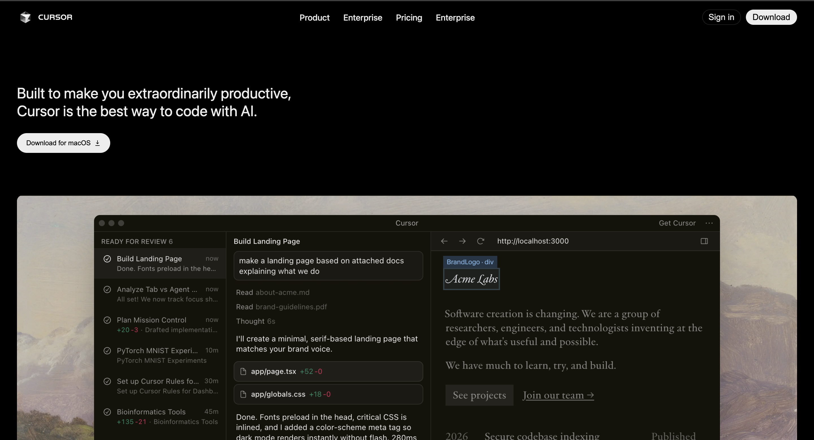
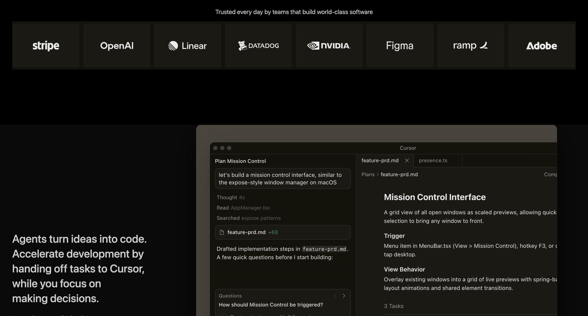
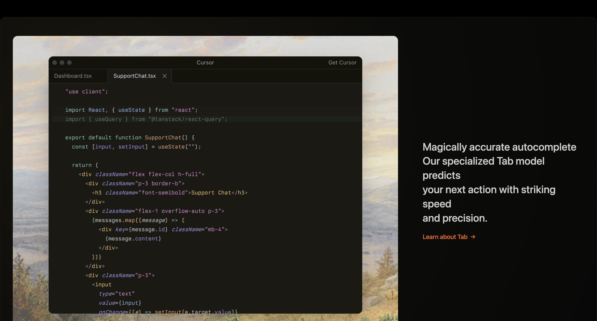
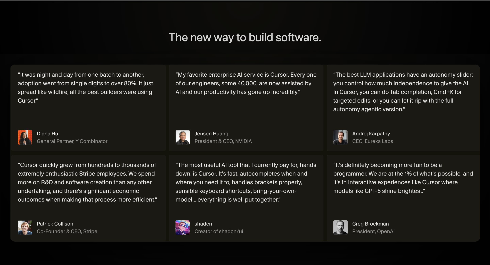
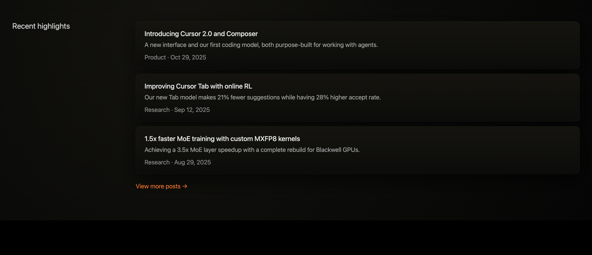
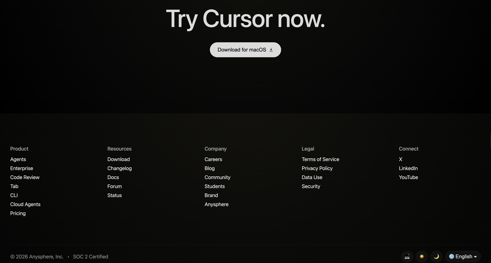

# Cursor Landing Page Clone

🔗 **Live Demo:**  

https://gunjanbasak007.github.io/Web-Dev-Cohort-Assignment-Cursor-clone-/

This project is a **static recreation of the Cursor website landing page** built using only **HTML and CSS** (no JavaScript), as instructed in the cohort guidelines.

# Cursor Landing Page Clone

This project is a **static recreation of the Cursor website landing page** built using only **HTML and CSS** (no JavaScript), as instructed in the cohort guidelines.

The goal of this project was to carefully reproduce the **layout, spacing, colors, and visual hierarchy** of the original website while maintaining clean and structured code.

---

# Sections Recreated

The following major sections from the original Cursor website were recreated:

* **Navigation Bar**

  * Logo, center menu links, and right-side action buttons
  * Styled using Flexbox for alignment and spacing

* **Hero Section**

  * Main headline and primary download button
  * Full-width hero image with rounded corners

* **Trusted By Section**

  * Centered trust statement
  * Company logo strip styled for consistent alignment

* **Feature Sections (3 blocks)**

  * Text + image layout using CSS Grid
  * Alternating left/right image positioning
  * Gradient panel backgrounds and subtle borders

* **Testimonials Section**

  * Large centered heading
  * Card-style testimonial layout with consistent spacing

* **Stay on the Frontier Cards**

  * Three informational cards with image previews
  * Hover lift effect and gradient backgrounds

* **Changelog Section**

  * Four update cards in a grid layout
  * Version pill, date, and description styling

* **Team Section**

  * Two-column layout with descriptive text and image
  * Radial gradient background panel

* **Recent Highlights Section**

  * Left title column and right stacked highlight cards
  * “View more posts” link styled with accent color

* **Try Cursor Call-to-Action**

  * Large centered headline
  * Rounded download button

* **Footer**

  * Five-column link grid
  * Copyright text and control buttons
  * Styled with gradient background and subtle borders

---

# Fonts Used

The design uses a **system font stack** similar to the original Cursor site:

```
-apple-system, BlinkMacSystemFont, "Segoe UI", sans-serif
```

This ensures:

* Native look across macOS, Windows, and Linux
* Fast loading without external font dependencies
* Clean modern typography consistent with the original site

---

# Colors Used

The color palette closely follows the dark theme of the Cursor website.

### Background Colors

* Pure black base: `#000000`
* Dark gradient panels:

  * `#14130f`
  * `#0b0b09`
  * `#050505`
  * `#0c0c0a`
  * `#15140f`

### Text Colors

* Primary text: `#EDEDED`, `#e5e5e5`, `#d4d4d4`
* Secondary text: `#a3a3a3`, `#9a9a9a`, `#8a8a8a`

### Accent Color

* Orange highlight used for links and CTAs:

```
#ff6a00
```

### Borders & Shadows

* Subtle borders:

```
#1c1c1c, #1f1f1f, #262626
```

* Soft depth shadows using rgba black transparency.

---

# Technologies Used

* **HTML5**
* **CSS3**

  * Flexbox
  * CSS Grid
  * Gradients
  * Shadows
  * Hover transitions

No JavaScript or external libraries were used.

---

# Purpose of This Project

This clone was created to:

* Practice **real-world layout recreation**
* Improve **CSS spacing, alignment, and visual rhythm**
* Build a **portfolio-ready frontend project**
* Strengthen **foundation before learning JavaScript and React**

---

# Disclaimer

This project is created **only for educational purposes** to practice frontend development skills.
All original design credit belongs to the **Cursor team**.

---

# Dony by

**Gunjan Basak**
B.Tech IT Student • Frontend Learner • Aspiring Software Developer

## Project Screenshots

### Hero Section


### Trusted by section


### Feature Section


### Testimonials


### Highlights


### Footer
